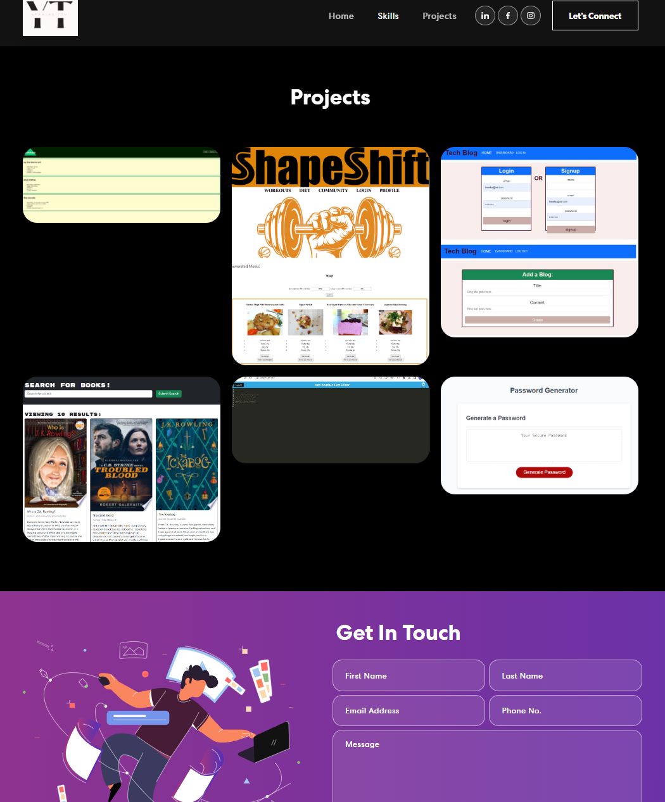
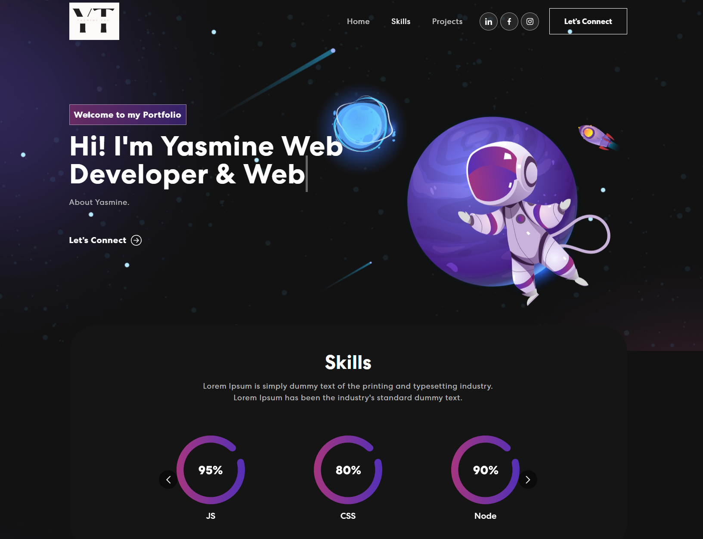

# YT-Portfolio

AS AN employer looking for candidates with experience building single-page applications
I WANT to view a potential employee's deployed React portfolio of work samples
SO THAT I can assess whether they're a good candidate for an open position

## Built using:

- Front-end library: React
- CSS framework: React-bootstrap
- CSS animations library: Animate.css

## Installation

To run this project, pull it from Github to your local machine using your terminal.

Steps:
Open Github
Navigate to the 'Yasminetsu/YT-Portfolio' repository.
Click the green button on the page that says "code."
Copy the link under SSH.
Open your terminal and type the following keys.

$ cd <any folder you want this repository to go to>
$ git clone <paste the copied link>

## Link Deploy

http://localhost:3000/YT-Portfolio
https://yasminetsu.github.io/YT-PortfolioLinks to an external site.

## Imgs

  
  
